# UX ARCHITECTURE & DESIGN SYSTEM

**Version:** 2.0 (Native iOS Edition)  
**Status:** IMPLEMENTATION READY  
**Last Updated:** January 3, 2026  
**Constraint:** Article V (CONSTITUTION.md) - Native iOS Components Only

---

## OVERVIEW

Exit's design philosophy: **Invisible Design**. The app should feel like Apple built it as a native Screen Time intervention tool.

---

## SECTION 1: DESIGN CONSTRAINTS (IMMUTABLE)

Per **CONSTITUTION.md Article V**, the following are **non-negotiable**:

### **1.1 Typography**
```typescript
// src/shared/theme/typography.ts
import { TextStyle } from 'react-native';

export const typography = {
  // Large Title (iOS 11+)
  largeTitle: {
    fontFamily: 'SF Pro Display',
    fontSize: 34,
    fontWeight: '700',
    letterSpacing: 0.37,
  } as TextStyle,
  
  // Title 1
  title1: {
    fontFamily: 'SF Pro Display',
    fontSize: 28,
    fontWeight: '700',
    letterSpacing: 0.36,
  } as TextStyle,
  
  // Title 2
  title2: {
    fontFamily: 'SF Pro Display',
    fontSize: 22,
    fontWeight: '700',
    letterSpacing: 0.35,
  } as TextStyle,
  
  // Title 3
  title3: {
    fontFamily: 'SF Pro Display',
    fontSize: 20,
    fontWeight: '600',
    letterSpacing: 0.38,
  } as TextStyle,
  
  // Headline
  headline: {
    fontFamily: 'SF Pro Text',
    fontSize: 17,
    fontWeight: '600',
    letterSpacing: -0.41,
  } as TextStyle,
  
  // Body
  body: {
    fontFamily: 'SF Pro Text',
    fontSize: 17,
    fontWeight: '400',
    letterSpacing: -0.41,
  } as TextStyle,
  
  // Callout
  callout: {
    fontFamily: 'SF Pro Text',
    fontSize: 16,
    fontWeight: '400',
    letterSpacing: -0.32,
  } as TextStyle,
  
  // Subhead
  subhead: {
    fontFamily: 'SF Pro Text',
    fontSize: 15,
    fontWeight: '400',
    letterSpacing: -0.24,
  } as TextStyle,
  
  // Footnote
  footnote: {
    fontFamily: 'SF Pro Text',
    fontSize: 13,
    fontWeight: '400',
    letterSpacing: -0.08,
  } as TextStyle,
  
  // Caption 1
  caption1: {
    fontFamily: 'SF Pro Text',
    fontSize: 12,
    fontWeight: '400',
    letterSpacing: 0,
  } as TextStyle,
  
  // Caption 2
  caption2: {
    fontFamily: 'SF Pro Text',
    fontSize: 11,
    fontWeight: '400',
    letterSpacing: 0.06,
  } as TextStyle,
};
```

### **1.2 Color System**
```typescript
// src/shared/theme/colors.ts
import { useColorScheme } from 'react-native';

export interface SystemColors {
  // Labels
  label: string;
  secondaryLabel: string;
  tertiaryLabel: string;
  quaternaryLabel: string;
  
  // Backgrounds
  systemBackground: string;
  secondarySystemBackground: string;
  tertiarySystemBackground: string;
  systemGroupedBackground: string;
  secondarySystemGroupedBackground: string;
  tertiarySystemGroupedBackground: string;
  
  // Fills
  systemFill: string;
  secondarySystemFill: string;
  tertiarySystemFill: string;
  quaternarySystemFill: string;
  
  // System Colors
  systemBlue: string;
  systemGreen: string;
  systemOrange: string;
  systemRed: string;
  systemYellow: string;
  systemPurple: string;
  systemPink: string;
  systemTeal: string;
  systemIndigo: string;
  
  // Grays
  systemGray: string;
  systemGray2: string;
  systemGray3: string;
  systemGray4: string;
  systemGray5: string;
  systemGray6: string;
  
  // Separator
  separator: string;
  opaqueSeparator: string;
}

export const useSystemColors = (): SystemColors => {
  const scheme = useColorScheme();
  const isDark = scheme === 'dark';
  
  return {
    // Labels
    label: isDark ? '#FFFFFF' : '#000000',
    secondaryLabel: isDark ? 'rgba(235, 235, 245, 0.6)' : 'rgba(60, 60, 67, 0.6)',
    tertiaryLabel: isDark ? 'rgba(235, 235, 245, 0.3)' : 'rgba(60, 60, 67, 0.3)',
    quaternaryLabel: isDark ? 'rgba(235, 235, 245, 0.18)' : 'rgba(60, 60, 67, 0.18)',
    
    // Backgrounds
    systemBackground: isDark ? '#000000' : '#FFFFFF',
    secondarySystemBackground: isDark ? '#1C1C1E' : '#F2F2F7',
    tertiarySystemBackground: isDark ? '#2C2C2E' : '#FFFFFF',
    systemGroupedBackground: isDark ? '#000000' : '#F2F2F7',
    secondarySystemGroupedBackground: isDark ? '#1C1C1E' : '#FFFFFF',
    tertiarySystemGroupedBackground: isDark ? '#2C2C2E' : '#F2F2F7',
    
    // Fills
    systemFill: isDark ? 'rgba(120, 120, 128, 0.36)' : 'rgba(120, 120, 128, 0.20)',
    secondarySystemFill: isDark ? 'rgba(120, 120, 128, 0.32)' : 'rgba(120, 120, 128, 0.16)',
    tertiarySystemFill: isDark ? 'rgba(118, 118, 128, 0.24)' : 'rgba(118, 118, 128, 0.12)',
    quaternarySystemFill: isDark ? 'rgba(118, 118, 128, 0.18)' : 'rgba(116, 116, 128, 0.08)',
    
    // System Colors (same in light/dark)
    systemBlue: '#007AFF',
    systemGreen: '#34C759',
    systemOrange: '#FF9500',
    systemRed: '#FF3B30',
    systemYellow: '#FFCC00',
    systemPurple: '#AF52DE',
    systemPink: '#FF2D55',
    systemTeal: '#5AC8FA',
    systemIndigo: '#5856D6',
    
    // Grays
    systemGray: '#8E8E93',
    systemGray2: isDark ? '#636366' : '#AEAEB2',
    systemGray3: isDark ? '#48484A' : '#C7C7CC',
    systemGray4: isDark ? '#3A3A3C' : '#D1D1D6',
    systemGray5: isDark ? '#2C2C2E' : '#E5E5EA',
    systemGray6: isDark ? '#1C1C1E' : '#F2F2F7',
    
    // Separator
    separator: isDark ? 'rgba(84, 84, 88, 0.6)' : 'rgba(60, 60, 67, 0.29)',
    opaqueSeparator: isDark ? '#38383A' : '#C6C6C8',
  };
};
```

### **1.3 Spacing Scale**
```typescript
// src/shared/theme/spacing.ts
export const spacing = {
  xs: 4,
  sm: 8,
  md: 16,
  lg: 24,
  xl: 32,
  xxl: 48,
  
  // Semantic aliases
  cellPadding: 16,
  sectionSpacing: 24,
  screenPadding: 16,
};
```

### **1.4 Animation Timing**
```typescript
// src/shared/theme/animations.ts
export const animations = {
  // Standard iOS timing
  duration: {
    instant: 0,
    fast: 150,
    normal: 300,
    slow: 500,
  },
  
  // Easing curves (same as UIView.animate)
  easing: {
    easeOut: { x1: 0.25, y1: 0.1, x2: 0.25, y2: 1 },
    easeIn: { x1: 0.42, y1: 0, x2: 1, y2: 1 },
    easeInOut: { x1: 0.42, y1: 0, x2: 0.58, y2: 1 },
    linear: { x1: 0, y1: 0, x2: 1, y2: 1 },
  },
};
```

---

## SECTION 2: USER FLOWS

### **2.1 Golden Path (First Time User)**

```mermaid
flowchart TD
    Start([User Downloads Exit]) --> Launch[App Launch]
    Launch --> Welcome[Welcome Screen]
    
    Welcome --> Permissions[Request Screen Time Permission]
    Permissions --> GrantCheck{Permission Granted?}
    
    GrantCheck -->|Yes| AppSelection[Select Apps to Monitor]
    GrantCheck -->|No| PermissionError[Show Error: Required]
    
    PermissionError --> Permissions
    
    AppSelection --> SelectApps{User Selects 1+ Apps?}
    SelectApps -->|Yes| Dashboard[Navigate to Dashboard]
    SelectApps -->|No| RequireApps[Prompt: Select at least 1 app]
    
    RequireApps --> AppSelection
    
    Dashboard --> ShowClarity[Display Clarity Score: 100%]
    ShowClarity --> UserScrolls[User Scrolls Instagram 30 min]
    
    UserScrolls --> ClarityDrops[Clarity: 100% → 85%]
    ClarityDrops --> UIBlurs[Dashboard Blurs Slightly]
    
    UIBlurs --> MoreScrolling{User Continues?}
    MoreScrolling -->|Yes, 30 more min| ClarityDropsMore[Clarity: 85% → 70%]
    MoreScrolling -->|No| Wait[Wait for next scroll session]
    
    ClarityDropsMore --> UIBlursMore[Dashboard Blurs Heavily]
    UIBlursMore --> UserNotices[User Opens Exit to Check]
    
    UserNotices --> SeesBlur[Sees Blurred UI]
    SeesBlur --> OpenInstagram[User Tries to Open Instagram]
    
    OpenInstagram --> ShieldCheck{Clarity < 60% OR 3+ Opens?}
    ShieldCheck -->|No| AllowAccess[Instagram Opens Normally]
    ShieldCheck -->|Yes| ShowShield[Shield Appears]
    
    ShowShield --> ShieldUI[Modal: Clarity 70%, Restore Clarity Button]
    ShieldUI --> UserTaps{User Taps Button?}
    
    UserTaps -->|Yes| ActionSelection[Show Actions List]
    UserTaps -->|No| Dismiss[User Dismisses]
    
    Dismiss --> DismissCount{Dismissals Today}
    DismissCount -->|<3| AllowDismiss[Allow Dismissal]
    DismissCount -->|≥3| ForcedIntervention[Shield Mandatory]
    
    AllowDismiss --> OpenInstagram
    ForcedIntervention --> ActionSelection
    
    ActionSelection --> ChooseAction[User Selects: Box Breathing]
    ChooseAction --> StartBreathing[Breathing Exercise Screen]
    
    StartBreathing --> Cycle1[Cycle 1/5: Inhale → Hold → Exhale → Hold]
    Cycle1 --> Cycle2[Cycle 2/5...]
    Cycle2 --> Cycle3[Cycle 3/5...]
    Cycle3 --> Cycle4[Cycle 4/5...]
    Cycle4 --> Cycle5[Cycle 5/5]
    
    Cycle5 --> Complete[Exercise Complete]
    Complete --> RestoreClarity[Clarity: 70% → 75%]
    
    RestoreClarity --> SuccessHaptic[Success Haptic Feedback]
    SuccessHaptic --> UnlockWindow[60-Second Unlock Window]
    
    UnlockWindow --> OpenInstagramUnlocked[Instagram Opens]
    OpenInstagramUnlocked --> Timer[60s Timer Starts]
    
    Timer --> After60[60 Seconds Elapsed]
    After60 --> ShieldReactivates[Shield Reactivates on Next Open]
    
    ShieldReactivates --> CoreLoop[Core Loop Continues...]
    
    style Start fill:#48bb78,color:#fff
    style Complete fill:#667eea,color:#fff
    style ShieldReactivates fill:#f6ad55,color:#000
```


### **2.2 Intervention Flow (Detailed)**

```mermaid
stateDiagram-v2
    [*] --> Normal: User scrolling normally
    
    Normal --> ClarityLow: Clarity drops below 60%
    Normal --> DoomLoop: 3+ app opens in 30 min
    
    state ClarityLow {
        [*] --> Trigger
        Trigger: Shield triggers on app open
    }
    
    state DoomLoop {
        [*] --> TriggerLoop
        TriggerLoop: Shield triggers immediately
    }
    
    ClarityLow --> ShieldActive
    DoomLoop --> ShieldActive
    
    state ShieldActive {
        [*] --> DisplayModal
        DisplayModal: Show Somatic Shield
        DisplayModal --> ShowClarity: Display current clarity %
        ShowClarity --> ShowButton: "Restore Clarity" button
    }
    
    ShieldActive --> UserDecision: User interaction
    
    state UserDecision {
        [*] --> Choice
        Choice: Tap button or dismiss?
    }
    
    UserDecision --> Dismissed: User dismisses
    UserDecision --> Accepted: User taps button
    
    state Dismissed {
        [*] --> CountDismissals
        CountDismissals: Increment daily count
        CountDismissals --> CheckLimit: Count < 3?
    }
    
    Dismissed --> AllowAccess: Yes
    Dismissed --> MandatoryShield: No (3+ dismissals)
    
    MandatoryShield --> Accepted: Must complete action
    
    state Accepted {
        [*] --> ShowActions
        ShowActions: Navigate to Actions list
        ShowActions --> UserPicks: User selects action
    }
    
    Accepted --> ActionScreen: Breathing selected
    
    state ActionScreen {
        [*] --> Initialize
        Initialize: Load breathing pattern
        Initialize --> Cycle1: Start cycle 1/5
        Cycle1 --> Cycle2: Complete
        Cycle2 --> Cycle3
        Cycle3 --> Cycle4
        Cycle4 --> Cycle5
        Cycle5 --> Done: All cycles complete
    }
    
    ActionScreen --> Completed: User completes
    
    state Completed {
        [*] --> UpdateClarity
        UpdateClarity: Clarity += 5 points
        UpdateClarity --> SetUnlock: Timestamp + 60s
        SetUnlock --> SuccessHaptic: Fire success haptic
    }
    
    Completed --> UnlockWindow
    
    state UnlockWindow {
        [*] --> Countdown
        Countdown: 60 seconds active
        Countdown --> AppOpens: User opens monitored app
        AppOpens --> AllowThrough: Shield reads timestamp
    }
    
    UnlockWindow --> [*]: Timer expires
    
    AllowAccess --> [*]
    [*] --> Normal: New session

    note right of ShieldActive
        UIBlurEffect + Modal
        System colors
        SF Symbols icons
    end note
    
    note right of ActionScreen
        Native animations
        Standard timing curves
        Success haptic on completion
    end note
```


---

## SECTION 3: COMPONENT LIBRARY (NATIVE iOS)

### **3.1 Core Components**

#### **NativeButton**
```typescript
// src/shared/components/NativeButton.tsx
import React from 'react';
import { TouchableOpacity, Text, StyleSheet, ActivityIndicator } from 'react-native';
import { useSystemColors } from '../theme/colors';
import { typography } from '../theme/typography';

interface NativeButtonProps {
  title: string;
  onPress: () => void;
  variant?: 'primary' | 'secondary' | 'destructive';
  disabled?: boolean;
  loading?: boolean;
}

export const NativeButton: React.FC<NativeButtonProps> = ({
  title,
  onPress,
  variant = 'primary',
  disabled = false,
  loading = false,
}) => {
  const colors = useSystemColors();
  
  const getBackgroundColor = () => {
    if (disabled) return colors.quaternarySystemFill;
    switch (variant) {
      case 'primary': return colors.systemBlue;
      case 'secondary': return colors.secondarySystemFill;
      case 'destructive': return colors.systemRed;
    }
  };
  
  const getTextColor = () => {
    if (disabled) return colors.tertiaryLabel;
    return variant === 'secondary' ? colors.label : '#FFFFFF';
  };
  
  return (
    <TouchableOpacity
      style={[
        styles.button,
        { backgroundColor: getBackgroundColor() }
      ]}
      onPress={onPress}
      disabled={disabled || loading}
      activeOpacity={0.7}
    >
      {loading ? (
        <ActivityIndicator color={getTextColor()} />
      ) : (
        <Text style={[typography.body, { color: getTextColor(), fontWeight: '600' }]}>
          {title}
        </Text>
      )}
    </TouchableOpacity>
  );
};

const styles = StyleSheet.create({
  button: {
    height: 50,
    borderRadius: 10,
    justifyContent: 'center',
    alignItems: 'center',
    paddingHorizontal: 20,
  },
});
```

#### **NativeCard**
```typescript
// src/shared/components/NativeCard.tsx
import React from 'react';
import { View, StyleSheet } from 'react-native';
import { useSystemColors } from '../theme/colors';

interface NativeCardProps {
  children: React.ReactNode;
  padding?: number;
}

export const NativeCard: React.FC<NativeCardProps> = ({
  children,
  padding = 16,
}) => {
  const colors = useSystemColors();
  
  return (
    <View 
      style={[
        styles.card,
        {
          backgroundColor: colors.secondarySystemGroupedBackground,
          padding,
        }
      ]}
    >
      {children}
    </View>
  );
};

const styles = StyleSheet.create({
  card: {
    borderRadius: 10,
    marginBottom: 16,
  },
});
```

#### **ClarityOverlay**
```typescript
// src/features/dashboard/components/ClarityOverlay.tsx
import React, { useEffect, useRef } from 'react';
import { View, StyleSheet, Animated } from 'react-native';
import { BlurView } from 'expo-blur';

interface ClarityOverlayProps {
  clarity: number; // 0-100
}

export const ClarityOverlay: React.FC<ClarityOverlayProps> = ({ clarity }) => {
  const opacityAnim = useRef(new Animated.Value(0)).current;
  
  useEffect(() => {
    // Map clarity (0-100) to opacity (0.0-0.5)
    const targetOpacity = (100 - clarity) / 100 * 0.5;
    
    // Standard iOS timing
    Animated.timing(opacityAnim, {
      toValue: targetOpacity,
      duration: 300,
      useNativeDriver: true,
    }).start();
  }, [clarity]);
  
  // Map clarity to blur intensity
  const blurIntensity = 100 - clarity;
  
  // Don't render if clarity is near-perfect
  if (clarity >= 90) {
    return null;
  }
  
  return (
    <View 
      style={styles.container}
      pointerEvents="none"
    >
      <BlurView
        intensity={blurIntensity}
        tint="systemChromeMaterialDark"
        style={StyleSheet.absoluteFill}
      />
      <Animated.View 
        style={[
          styles.opacityLayer,
          { opacity: opacityAnim }
        ]}
      />
    </View>
  );
};

const styles = StyleSheet.create({
  container: {
    ...StyleSheet.absoluteFillObject,
    zIndex: 10,
  },
  opacityLayer: {
    ...StyleSheet.absoluteFillObject,
    backgroundColor: '#000000',
  },
});
```

### **3.2 Component State Variations**

| Component | States | Visual Changes |
|-----------|--------|----------------|
| **NativeButton** | Default, Pressed, Disabled, Loading | Opacity 1.0 → 0.7, spinner replaces text |
| **NativeCard** | Default, Light, Dark | Background adapts to color scheme |
| **ClarityOverlay** | 0-100% clarity | Blur 0-100, opacity 0.0-0.5 |
| **SomaticShield** | Locked, Unlocked | Button text, countdown timer |

---

## SECTION 4: MOTION DESIGN

### **4.1 Animation Principles**

**Follow iOS HIG:**
- Animations should feel **responsive**, not sluggish
- Use standard timing curves (ease-out for entrances, ease-in for exits)
- Respect user's Reduce Motion setting

### **4.2 Standard Animations**
```typescript
// src/shared/utils/animations.ts
import { Animated } from 'react-native';

export const Animations = {
  // Fade in (modal appear)
  fadeIn: (anim: Animated.Value, duration: number = 300) => {
    return Animated.timing(anim, {
      toValue: 1,
      duration,
      useNativeDriver: true,
    });
  },
  
  // Fade out (modal dismiss)
  fadeOut: (anim: Animated.Value, duration: number = 300) => {
    return Animated.timing(anim, {
      toValue: 0,
      duration,
      useNativeDriver: true,
    });
  },
  
  // Scale up (success celebration)
  scaleUp: (anim: Animated.Value, duration: number = 150) => {
    return Animated.spring(anim, {
      toValue: 1.05,
      friction: 7,
      tension: 40,
      useNativeDriver: true,
    });
  },
  
  // Scale down (back to normal)
  scaleDown: (anim: Animated.Value, duration: number = 150) => {
    return Animated.spring(anim, {
      toValue: 1,
      friction: 7,
      tension: 40,
      useNativeDriver: true,
    });
  },
  
  // Breathing animation (inhale/exhale)
  breathe: (anim: Animated.Value, toValue: number, duration: number) => {
    return Animated.timing(anim, {
      toValue,
      duration: duration * 1000,
      useNativeDriver: true,
    });
  },
};
```

### **4.3 Haptic Patterns**
```typescript
// src/shared/hooks/useHaptics.ts
import * as Haptics from 'expo-haptics';

export const useHaptics = () => {
  return {
    // Button tap
    selection: () => {
      Haptics.selectionAsync();
    },
    
    // Success (action completed)
    success: () => {
      Haptics.notificationAsync(Haptics.NotificationFeedbackType.Success);
    },
    
    // Warning (clarity low)
    warning: () => {
      Haptics.notificationAsync(Haptics.NotificationFeedbackType.Warning);
    },
    
    // Error (shield mandatory)
    error: () => {
      Haptics.notificationAsync(Haptics.NotificationFeedbackType.Error);
    },
    
    // Light impact (breathing phase change)
    light: () => {
      Haptics.impactAsync(Haptics.ImpactFeedbackStyle.Light);
    },
    
    // Medium impact (clarity restored)
    medium: () => {
      Haptics.impactAsync(Haptics.ImpactFeedbackStyle.Medium);
    },
    
    // Heavy impact (level up)
    heavy: () => {
      Haptics.impactAsync(Haptics.ImpactFeedbackStyle.Heavy);
    },
  };
};
```

---

## SECTION 5: ASSETS CATALOG

### **5.1 SF Symbols (MVP)**

| Symbol Name | Usage | Context |
|-------------|-------|---------|
| `waveform.circle.fill` | Breathing actions | Actions list |
| `figure.walk` | Walking actions | Actions list |
| `drop.fill` | Hydration | Actions list |
| `hourglass` | Screen time permission | Onboarding |
| `checkmark.circle.fill` | Action completed | Success states |
| `exclamationmark.triangle.fill` | Low clarity warning | Shield |
| `exclamationmark.circle.fill` | Moderate clarity | Dashboard |
| `exclamationmark.octagon.fill` | Critical clarity | Shield |
| `sparkles` | Crystal clarity | Dashboard |
| `lock.fill` | Pro actions locked | Actions list |
| `chevron.right` | Navigation | List cells |
| `xmark.circle.fill` | Dismiss | Modals |

### **5.2 App Icon States**
```
assets/icon.png           (1024x1024, required)
assets/icon-ios.png       (1024x1024, rounded by iOS)
assets/adaptive-icon.png  (1024x1024, Android future)
assets/splash.png         (1284x2778, launch screen)
```

**Icon Design Guidelines:**
- Simple geometric shape (circle or rounded square)
- Single solid color (system blue #007AFF recommended)
- SF Symbol inside (e.g., waveform or sparkles)
- No text, no gradients, no shadows

---

## SECTION 6: ACCESSIBILITY

### **6.1 VoiceOver Support**
```typescript
// Example: Accessible button
<TouchableOpacity
  accessible={true}
  accessibilityRole="button"
  accessibilityLabel="Restore clarity"
  accessibilityHint="Completes an action to restore your clarity score"
  onPress={handlePress}
>
  <Text>Restore Clarity</Text>
</TouchableOpacity>
```

### **6.2 Dynamic Type**
```typescript
// src/shared/hooks/useScaledFontSize.ts
import { PixelRatio } from 'react-native';

export const useScaledFontSize = (baseFontSize: number): number => {
  const fontScale = PixelRatio.getFontScale();
  return baseFontSize * fontScale;
};

// Usage
const fontSize = useScaledFontSize(17); // Scales with user's text size settings
```

### **6.3 Color Contrast**

All text must meet **WCAG AA** standards:
- Normal text: 4.5:1 contrast ratio
- Large text (≥18pt): 3:1 contrast ratio

System colors automatically meet these requirements.

---

## SECTION 7: RESPONSIVE DESIGN

### **7.1 Device Support**

| Device | Screen Size | UI Adjustments |
|--------|-------------|----------------|
| iPhone SE | 375x667 | Standard |
| iPhone 14 | 390x844 | Standard |
| iPhone 14 Pro Max | 430x932 | Larger touch targets |
| iPad Mini | 744x1133 | Tablet layout (Phase 2) |

### **7.2 Safe Area Handling**
```typescript
// Use SafeAreaView for all screens
import { SafeAreaView } from 'react-native-safe-area-context';

export default function DashboardScreen() {
  return (
    <SafeAreaView style={{ flex: 1 }}>
      {/* Content */}
    </SafeAreaView>
  );
}
```

---

**Document Status:** IMPLEMENTATION READY  
**Dependencies:** React Native 0.73+, expo-blur, expo-haptics, react-native-sfsymbols  
**Next Review:** Post-Beta (Week 10)

---
