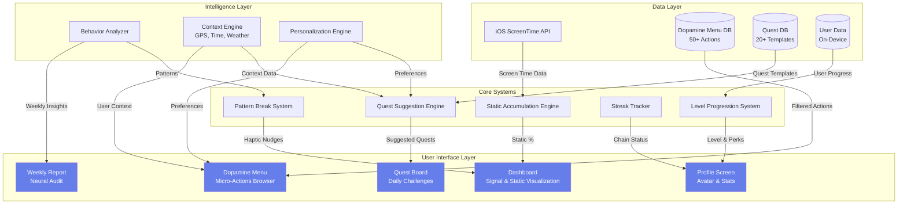
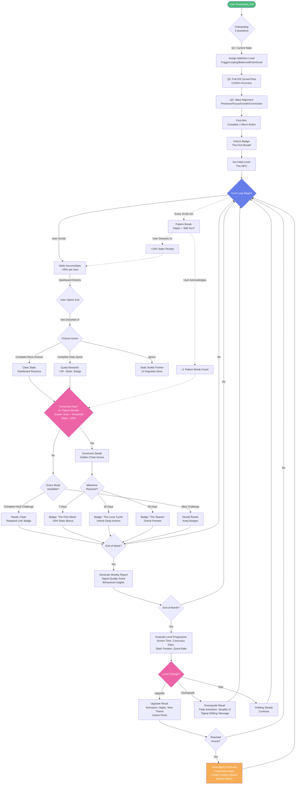
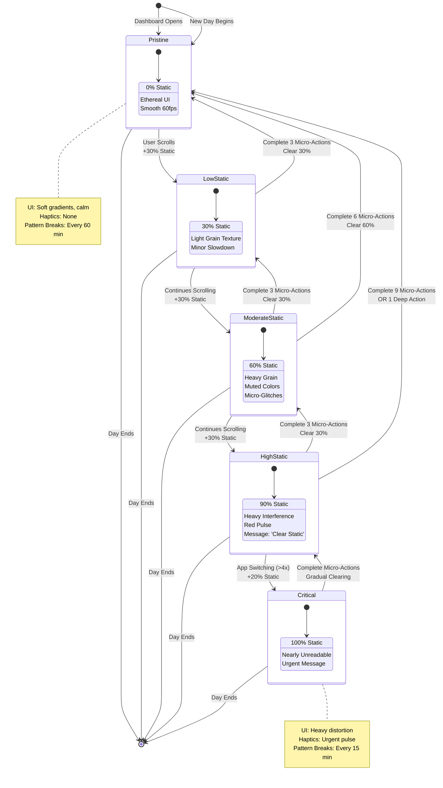
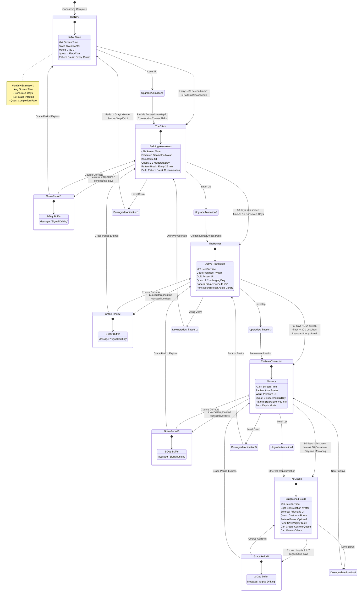

# Exit - UML Diagrams
**Comprehensive System & User Behavior Flow**

---

## 1. Overall System Architecture



---

## 2. User Journey Flow (Onboarding → Mastery)



---

## 3. Core Loop State Machine (Signal & Static)



---

## 4. Level Progression State Machine



---

## 5. Quest Selection Algorithm Flow

```mermaid
flowchart TD
    Start([Daily Quest Selection<br/>Triggered]) --> PullProfile[Pull User Profile:<br/>Level, Location, Time,<br/>History, Preferences]
    
    PullProfile --> FilterQuests{Filter Eligible Quests}
    
    FilterQuests -->|Match Difficulty| DifficultyFilter[NPC: Easy Only<br/>Glitch: Easy + Moderate<br/>Hacker: All except Mastery<br/>Main Character/Oracle: All]
    
    FilterQuests -->|Match Context| ContextFilter[Home/Work/Outside<br/>Based on GPS]
    
    FilterQuests -->|Match Unlock Level| LevelFilter[Only Unlocked Quests<br/>for Current Level]
    
    DifficultyFilter --> EligiblePool[Eligible Quest Pool]
    ContextFilter --> EligiblePool
    LevelFilter --> EligiblePool
    
    EligiblePool --> ScoreRelevance[Score Each Quest by:<br/>Behavioral Triggers<br/>Time of Day<br/>Weather Conditions<br/>Recent Completions]
    
    ScoreRelevance --> TimeScore{Time-Based Scoring}
    
    TimeScore -->|Morning 6-10 AM| MorningQuests[+Weight:<br/>Morning Pledge<br/>Dawn Departure<br/>Coffee Meditation]
    TimeScore -->|Midday 11 AM-2 PM| MiddayQuests[+Weight:<br/>Lunch Away<br/>Word Sprint<br/>Face-to-Face]
    TimeScore -->|Evening 6-10 PM| EveningQuests[+Weight:<br/>Analog Evening<br/>Sonic Cleanse<br/>Sensory Shower]
    TimeScore -->|Weekend| WeekendQuests[+Weight:<br/>Micro-Adventure<br/>Museum Wander<br/>Culinary Deep Work]
    
    MorningQuests --> BehaviorScore
    MiddayQuests --> BehaviorScore
    EveningQuests --> BehaviorScore
    WeekendQuests --> BehaviorScore
    
    BehaviorScore{Behavioral Trigger Detection} -->|User scrolls at 9 PM| TriggerEvening[+50 Weight:<br/>Analog Evening<br/>Stillness]
    BehaviorScore -->|Immediate phone check on wake| TriggerMorning[+50 Weight:<br/>Morning Pledge]
    BehaviorScore -->|5+ app switches/hour| TriggerInterrupt[+50 Weight:<br/>Face-to-Face<br/>Nature Dose]
    BehaviorScore -->|No behavioral trigger| NoTrigger[Standard Weights]
    
    TriggerEvening --> LocationScore
    TriggerMorning --> LocationScore
    TriggerInterrupt --> LocationScore
    NoTrigger --> LocationScore
    
    LocationScore{Location-Based Scoring} -->|Near Parks| ParkQuests[+Weight:<br/>Nature Dose<br/>Sidewalk Stroll]
    LocationScore -->|Near Museums/Libraries| CultureQuests[+Weight:<br/>Museum Wander<br/>Bookshop Hour]
    LocationScore -->|At Home Evening| HomeQuests[+Weight:<br/>Maker's Block<br/>Analog Game Night]
    LocationScore -->|Commuting| TransitQuests[+Weight:<br/>Tech-Free Transit<br/>Coffee Meditation]
    
    ParkQuests --> WeatherCheck
    CultureQuests --> WeatherCheck
    HomeQuests --> WeatherCheck
    TransitQuests --> WeatherCheck
    
    WeatherCheck{Weather Conditions} -->|Sunny/Clear| OutdoorBoost[+Weight:<br/>All Outdoor Quests]
    WeatherCheck -->|Rain/Snow| IndoorBoost[+Weight:<br/>All Indoor Quests]
    
    OutdoorBoost --> HistoryCheck
    IndoorBoost --> HistoryCheck
    
    HistoryCheck[Check Completion History:<br/>Exclude quests completed<br/>in last 7 days] --> FinalScores[Calculate Final Scores<br/>for All Eligible Quests]
    
    FinalScores --> SelectPrimary[Select Primary Quest:<br/>Highest Score]
    SelectPrimary --> SelectAlternate[Select Alternate Quest:<br/>2nd Highest Score<br/>Different Category]
    
    SelectAlternate --> PresentQuests[Present 2 Quests to User:<br/>1 Primary + 1 Alternate]
    
    PresentQuests --> UserChoice{User Chooses Quest}
    
    UserChoice -->|Accepts Primary| TrackPrimary[Track Quest Progress:<br/>GPS/Timer/Self-Report]
    UserChoice -->|Accepts Alternate| TrackAlternate[Track Quest Progress]
    UserChoice -->|Dismisses Both| LogDismissal[Log Dismissal<br/>Adjust Future Weights]
    
    TrackPrimary --> Verification{Verification Method}
    TrackAlternate --> Verification
    
    Verification -->|GPS| GPSVerify[Monitor GPS<br/>Distance/Duration]
    Verification -->|Timer| TimerVerify[Monitor Timer<br/>Completion]
    Verification -->|Self-Report| SelfVerify[Wait for User<br/>Manual Completion]
    Verification -->|Screen Time API| ScreenVerify[Monitor Screen Time<br/>Data]
    
    GPSVerify --> CheckComplete{Quest<br/>Completed?}
    TimerVerify --> CheckComplete
    SelfVerify --> CheckComplete
    ScreenVerify --> CheckComplete
    
    CheckComplete -->|Yes| GrantRewards[Grant Rewards:<br/>+50 XP<br/>-10% Static<br/>+1 Conscious Day Credit<br/>Unique Badge]
    CheckComplete -->|No/Failed| FailureGrace{Failure<br/>Grace Rule?}
    
    FailureGrace -->|Grace Applies| PartialCredit[Grant Partial Credit:<br/>+25 XP<br/>Encouraging Message]
    FailureGrace -->|No Grace| NoReward[No Rewards<br/>Quest Resets Tomorrow]
    
    GrantRewards --> End([Quest Complete])
    PartialCredit --> End
    NoReward --> End
    LogDismissal --> End

    style Start fill:#48bb78,color:#fff
    style End fill:#f6ad55,color:#fff
    style GrantRewards fill:#667eea,color:#fff
```



---

## 6. Dopamine Menu Smart Matching Flow

```mermaid
flowchart TD
    Start([User Needs to Clear Static]) --> CheckStatic{How Much Static?}
    
    CheckStatic -->|30%| Need3[Need 3 Micro-Actions<br/>10-15 min total]
    CheckStatic -->|60%| Need6[Need 6 Micro-Actions<br/>20-30 min total]
    CheckStatic -->|90%| Need9[Need 9 Micro-Actions<br/>OR 1 Deep Action]
    
    Need3 --> GatherContext
    Need6 --> GatherContext
    Need9 --> GatherContext
    
    GatherContext[Gather User Context:<br/>Location GPS<br/>Time of Day<br/>Weather API<br/>Energy Level Self-Report] --> LocationContext{Current<br/>Location}
    
    LocationContext -->|Home| HomeFilter[Filter: Home Context<br/>+Anywhere]
    LocationContext -->|Work| WorkFilter[Filter: Work Context<br/>+Anywhere]
    LocationContext -->|Outside| OutsideFilter[Filter: Outside Context<br/>+Anywhere]
    LocationContext -->|Transit| TransitFilter[Filter: Transit Context<br/>+Anywhere]
    
    HomeFilter --> TimeContext
    WorkFilter --> TimeContext
    OutsideFilter --> TimeContext
    TransitFilter --> TimeContext
    
    TimeContext{Time of Day} -->|Morning 6-10 AM| MorningFilter[+Weight:<br/>Higher Energy Actions]
    TimeContext -->|Afternoon 10 AM-6 PM| AfternoonFilter[+Weight:<br/>Balanced Energy]
    TimeContext -->|Evening 6-10 PM| EveningFilter[+Weight:<br/>Lower Energy/Wind-Down]
    TimeContext -->|Night 10 PM+| NightFilter[+Weight:<br/>Low Energy Only]
    
    MorningFilter --> EnergyContext
    AfternoonFilter --> EnergyContext
    EveningFilter --> EnergyContext
    NightFilter --> EnergyContext
    
    EnergyContext{User Energy<br/>Level} -->|Low 1-3| LowEnergyFilter[Filter:<br/>Low Energy Actions Only<br/>Breathwork, Journaling, Listening]
    EnergyContext -->|Medium 4-6| MedEnergyFilter[Filter:<br/>Low + Medium Actions<br/>Walking, Stretching, Light Tasks]
    EnergyContext -->|High 7-10| HighEnergyFilter[All Energy Levels<br/>Including HIIT, Running, Cold Plunge]
    
    LowEnergyFilter --> WeatherContext
    MedEnergyFilter --> WeatherContext
    HighEnergyFilter --> WeatherContext
    
    WeatherContext{Weather<br/>Conditions} -->|Sunny/Clear| WeatherBoost1[+Weight:<br/>Outdoor Actions<br/>Walking, Nature Sit]
    WeatherContext -->|Rain/Snow| WeatherBoost2[+Weight:<br/>Indoor Actions<br/>Breathwork, Reading, Tea]
    WeatherContext -->|Extreme Heat/Cold| WeatherBoost3[Deprioritize:<br/>Long Outdoor Actions]
    
    WeatherBoost1 --> CompletionHistory
    WeatherBoost2 --> CompletionHistory
    WeatherBoost3 --> CompletionHistory
    
    CompletionHistory[Check Completion History:<br/>Avoid same action 3x/week<br/>Prioritize unfinished categories] --> SeasonalBoost{Seasonal<br/>Relevance}
    
    SeasonalBoost -->|Winter| WinterBoost[+Weight:<br/>Indoor/Warm Actions<br/>Tea Ritual, Brown Noise]
    SeasonalBoost -->|Spring| SpringBoost[+Weight:<br/>Outdoor/Nature<br/>Walking, Outdoor Sitting]
    SeasonalBoost -->|Summer| SummerBoost[+Weight:<br/>Early Morning/Evening<br/>Outdoor Actions]
    SeasonalBoost -->|Fall| FallBoost[+Weight:<br/>Transitional Actions<br/>Mixed Indoor/Outdoor]
    
    WinterBoost --> UnlockLevel
    SpringBoost --> UnlockLevel
    SummerBoost --> UnlockLevel
    FallBoost --> UnlockLevel
    
    UnlockLevel{User Level<br/>Restrictions} -->|NPC/Glitch| BasicActions[All Basic Actions<br/>Beginner-Friendly]
    UnlockLevel -->|Hacker| IntermediateActions[Basic + Intermediate<br/>Includes Structured Routines]
    UnlockLevel -->|Main Character/Oracle| AdvancedActions[All Actions<br/>Including Ice Bath, Extended Sessions]
    
    BasicActions --> FinalScoring
    IntermediateActions --> FinalScoring
    AdvancedActions --> FinalScoring
    
    FinalScoring[Calculate Final Scores:<br/>Context Match + Time + Energy<br/>+ Weather + History + Seasonal<br/>+ Unlock Level] --> RankActions[Rank All Eligible Actions<br/>by Final Score]
    
    RankActions --> SelectTop{Select Based on<br/>Static Level}
    
    SelectTop -->|30% Static| Select3[Select Top 5 Actions<br/>Present to User]
    SelectTop -->|60% Static| Select6[Select Top 8 Actions<br/>Present to User]
    SelectTop -->|90% Static| Select9[Select Top 12 Actions<br/>+ Deep Action Option]
    
    Select3 --> PresentMenu[Present Dopamine Menu<br/>Filtered & Sorted]
    Select6 --> PresentMenu
    Select9 --> PresentMenu
    
    PresentMenu --> UserSelects{User Selects<br/>Action}
    
    UserSelects -->|Micro-Action| StartTimer[Start Timer/Tracker<br/>Provide Instructions]
    UserSelects -->|Deep Action| StartDeep[Start Deep Action<br/>GPS/Motion Tracking]
    UserSelects -->|Dismiss Menu| LogDismiss[Log Dismissal<br/>Static Remains]
    
    StartTimer --> VerifyComplete{Action<br/>Completed?}
    StartDeep --> VerifyComplete
    
    VerifyComplete -->|Yes| ClearStatic[Clear Static:<br/>-10% per Action<br/>Smooth Wipe Animation]
    VerifyComplete -->|Partial| PartialClear[Partial Clear:<br/>-5% per Action<br/>Encouraging Message]
    VerifyComplete -->|No| NoChange[No Static Cleared<br/>Action Available Tomorrow]
    
    ClearStatic --> UpdateHistory[Update Completion History<br/>Adjust Future Weights]
    PartialClear --> UpdateHistory
    
    UpdateHistory --> CheckFullClear{All Static<br/>Cleared?}
    
    CheckFullClear -->|Yes| Success[Dashboard Fully Restored<br/>Haptic Celebration<br/>Message: 'Signal Clear']
    CheckFullClear -->|No| Partial[Dashboard Partially Clear<br/>Suggest More Actions]
    
    Success --> End([Complete])
    Partial --> End
    NoChange --> End
    LogDismiss --> End

    style Start fill:#48bb78,color:#fff
    style End fill:#f6ad55,color:#fff
    style Success fill:#667eea,color:#fff
```



---

## 7. Pattern Break System Flow

```mermaid
flowchart TD
    Start([User Using Phone]) --> MonitorUsage[Background Process<br/>Monitors Screen Time API]
    
    MonitorUsage --> CheckLevel{User's<br/>Addiction Level}
    
    CheckLevel -->|Critical 4h+ daily| Critical[Pattern Break<br/>Every 15 min]
    CheckLevel -->|High 3-4h daily| High[Pattern Break<br/>Every 25 min]
    CheckLevel -->|Moderate 2-3h daily| Moderate[Pattern Break<br/>Every 40 min]
    CheckLevel -->|Low <2h daily| Low[Pattern Break<br/>Every 60 min<br/>Optional]
    
    Critical --> TimerStart
    High --> TimerStart
    Moderate --> TimerStart
    Low --> OptionalCheck{User Enabled<br/>Pattern Breaks?}
    
    OptionalCheck -->|Yes| TimerStart
    OptionalCheck -->|No| End
    
    TimerStart[Start Timer<br/>Based on Frequency] --> WaitPeriod[Wait for<br/>Timer Interval]
    
    WaitPeriod --> CheckActivity{User Still<br/>Active on Phone?}
    
    CheckActivity -->|Yes| TriggerBreak[Trigger Pattern Break]
    CheckActivity -->|No| ResetTimer[Reset Timer<br/>Wait for Next Session]
    
    TriggerBreak --> BreakStyle{Break Style<br/>Based on Level}
    
    BreakStyle -->|Critical| CriticalBreak[Haptic Pulse<br/>+ Overlay Message<br/>+ Screen Dim<br/>Duration: 3 sec]
    BreakStyle -->|High| HighBreak[Haptic Pulse<br/>+ Screen Dim<br/>Duration: 2 sec]
    BreakStyle -->|Moderate| ModerateBreak[Haptic Pulse Only<br/>Duration: 1 sec]
    BreakStyle -->|Low| LowBreak[Subtle Haptic<br/>Duration: 0.5 sec]
    
    CriticalBreak --> ShowMessage
    HighBreak --> ShowMessage
    ModerateBreak --> NoMessage
    LowBreak --> NoMessage
    
    ShowMessage[Display Overlay Message:<br/>Random Selection from Bank] --> MessageBank{Message Type}
    
    MessageBank -->|Reflective| Reflective["Still you?"<br/>"What are you looking for?"]
    MessageBank -->|Grounding| Grounding["Breathe. Then decide."<br/>"Signal check."]
    MessageBank -->|Questioning| Questioning["Is this where you want to be?"]
    
    Reflective --> WaitResponse
    Grounding --> WaitResponse
    Questioning --> WaitResponse
    NoMessage --> ImplicitResponse
    
    WaitResponse[Wait 3 Seconds<br/>for User Response] --> UserResponse{User<br/>Response}
    
    UserResponse -->|Acknowledges/Closes| Acknowledge[+1 Pattern Break<br/>Count for Day]
    UserResponse -->|Continues Scrolling| Implicit[Implicit Acknowledgment<br/>+1 Pattern Break Count]
    UserResponse -->|Snoozes| CheckSnooze{Snooze Count<br/>Today}
    
    ImplicitResponse[Monitor for<br/>Usage Change] --> UsageChange{Usage Pattern<br/>Changes?}
    
    UsageChange -->|Puts Phone Down| ImplicitAck[+1 Pattern Break Count]
    UsageChange -->|Switches Apps| ImplicitAck
    UsageChange -->|Continues Same| NoCount[No Break Count]
    
    CheckSnooze -->|<3 Times| AllowSnooze[Snooze for 1 Hour<br/>Log Snooze Event]
    CheckSnooze -->|3+ Times| SnoozeLimit[Add +10% Static<br/>Message: 'Frequent Snoozing<br/>Adds Noise']
    
    Acknowledge --> LogBreak
    Implicit --> LogBreak
    ImplicitAck --> LogBreak
    AllowSnooze --> SnoozeTimer
    SnoozeLimit --> LogBreak
    NoCount --> TimerStart
    
    LogBreak[Log Pattern Break:<br/>Time, Duration, Response<br/>App Context] --> CheckCount{Total Breaks<br/>Today}
    
    CheckCount -->|<3| Continue[Continue Monitoring]
    CheckCount -->|3+| EligibleDay[Mark Day as Eligible<br/>for Conscious Day]
    
    Continue --> TimerStart
    EligibleDay --> TimerStart
    
    SnoozeTimer[1 Hour Snooze Timer] --> SnoozePeriod[User Continues<br/>Uninterrupted]
    SnoozePeriod --> ResumeMonitor[Resume Pattern Break<br/>Monitoring]
    ResumeMonitor --> TimerStart
    
    ResetTimer --> End([Monitoring Paused])
    
    %% Daily Reset
    TimerStart -.->|End of Day| DailyReset[Daily Reset:<br/>Clear Snooze Count<br/>Calculate Conscious Day<br/>Reset Pattern Break Count]
    DailyReset -.-> End

    style Start fill:#48bb78,color:#fff
    style End fill:#f6ad55,color:#fff
    style EligibleDay fill:#667eea,color:#fff
```

---

## 8. Streak & Grace Mode System

```mermaid
stateDiagram-v2
    [*] --> NoStreak: User Starts Exit
    
    NoStreak --> Day1: First Conscious Day<br/>Achieved
    
    state Day1 {
        [*] --> Chain1
        Chain1: 1 Conscious Day
        Chain1: Golden Thread Begins
        Chain1: Next Milestone: 7 Days
    }
    
    Day1 --> Day2: Another Conscious Day
    Day2 --> Day3: Another Conscious Day
    Day3 --> Day4: Another Conscious Day
    Day4 --> Day5: Another Conscious Day
    Day5 --> Day6: Another Conscious Day
    Day6 --> Week1Milestone: 7th Conscious Day
    
    state Week1Milestone {
        [*] --> Celebrate1
        Celebrate1: Badge: 'The First Week'
        Celebrate1: -20% Static Bonus
        Celebrate1: Haptic + Animation
        Celebrate1: Message: 'You're building<br/>a new pattern'
    }
    
    Week1Milestone --> ContinueWeek2: Continue Streak
    ContinueWeek2 --> Month1Milestone: 30 Conscious Days
    
    state Month1Milestone {
        [*] --> Celebrate2
        Celebrate2: Badge: 'The Lunar Cycle'
        Celebrate2: Unlock Deep Action Library
        Celebrate2: Enhanced Animation
        Celebrate2: Message: 'One month<br/>of sovereignty'
    }
    
    Month1Milestone --> ContinueMonth2: Continue Streak
    ContinueMonth2 --> Season1Milestone: 90 Conscious Days
    
    state Season1Milestone {
        [*] --> Celebrate3
        Celebrate3: Badge: 'The Season'
        Celebrate3: Oracle Tier Preview
        Celebrate3: Premium Animation
        Celebrate3: Message: 'You've woven<br/>a new neural pattern'
    }
    
    Season1Milestone --> MaintainStreak: Continue Beyond 90
    
    %% Breaking Streak
    Day1 --> BreakCheck1: Non-Conscious Day
    Day2 --> BreakCheck2: Non-Conscious Day
    Day3 --> BreakCheck3: Non-Conscious Day
    ContinueWeek2 --> BreakCheck4: Non-Conscious Day
    ContinueMonth2 --> BreakCheck5: Non-Conscious Day
    MaintainStreak --> BreakCheck6: Non-Conscious Day
    
    state BreakCheck1 {
        [*] --> Check1
        Check1: Streak at Risk
        Check1: 24-Hour Grace Window Opens
    }
    
    state BreakCheck2 {
        [*] --> Check2
        Check2: Streak at Risk
        Check2: 24-Hour Grace Window Opens
    }
    
    state BreakCheck3 {
        [*] --> Check3
        Check3: Streak at Risk
        Check3: 24-Hour Grace Window Opens
    }
    
    state BreakCheck4 {
        [*] --> Check4
        Check4: Streak at Risk
        Check4: 24-Hour Grace Window Opens
    }
    
    state BreakCheck5 {
        [*] --> Check5
        Check5: Streak at Risk
        Check5: 24-Hour Grace Window Opens
    }
    
    state BreakCheck6 {
        [*] --> Check6
        Check6: Streak at Risk
        Check6: 24-Hour Grace Window Opens
    }
    
    %% Grace Mode
    BreakCheck1 --> GraceMode: Offer Hard Challenge
    BreakCheck2 --> GraceMode
    BreakCheck3 --> GraceMode
    BreakCheck4 --> GraceMode
    BreakCheck5 --> GraceMode
    BreakCheck6 --> GraceMode
    
    state GraceMode {
        [*] --> OfferChallenges
        OfferChallenges: Choose 1 Hard Challenge:
        OfferChallenges: 1) 3h Completely Offline
        OfferChallenges: 2) 10 Micro-Actions Today
        OfferChallenges: 3) Full Day <30min Screen
        OfferChallenges: Must Complete in 24h
        
        state OfferChallenges {
            Challenge1: 3h Offline
            Challenge1: GPS + Motion Verified
            
            Challenge2: 10 Micro-Actions
            Challenge2: Timer Verified
            
            Challenge3: <30min Screen Time
            Challenge3: Screen Time API Verified
        }
    }
    
    GraceMode --> ChallengeAttempt: User Accepts Challenge
    GraceMode --> DeclineChallenge: User Declines
    
    state ChallengeAttempt {
        [*] --> Attempting
        Attempting: Challenge Active
        Attempting: Timer Running (24h)
        Attempting: Real-Time Progress Tracking
    }
    
    ChallengeAttempt --> ChallengeSuccess: Completed Within 24h
    ChallengeAttempt --> ChallengeFail: 24h Expired / Failed
    
    state ChallengeSuccess {
        [*] --> Repaired
        Repaired: Streak CONTINUES
        Repaired: Badge: 'Repaired Link'
        Repaired: Visual: Gold with Crack
        Repaired: Message: 'Resilience, not perfection'
    }
    
    ChallengeSuccess --> Day2: Streak Repaired
    
    state ChallengeFail {
        [*] --> Reset1
        Reset1: Streak RESETS to 0
        Reset1: Keep All Badges Earned
        Reset1: Message: 'Levels aren't linear.<br/>Begin again.'
    }
    
    state DeclineChallenge {
        [*] --> Reset2
        Reset2: Streak RESETS to 0
        Reset2: Keep All Badges Earned
        Reset2: Message: 'New chain begins<br/>with your next<br/>Conscious Day'
    }
    
    ChallengeFail --> NoStreak: Start Fresh
    DeclineChallenge --> NoStreak: Start Fresh
    
    %% Historical Tracking
    ChallengeSuccess --> HistoryUpdate: Update History
    ChallengeFail --> HistoryUpdate
    DeclineChallenge --> HistoryUpdate
    Week1Milestone --> HistoryUpdate
    Month1Milestone --> HistoryUpdate
    Season1Milestone --> HistoryUpdate
    
    state HistoryUpdate {
        [*] --> Record
        Record: Log Peak Streak Length
        Record: Log Total Conscious Days
        Record: Log Repairs Made
        Record: Log Badges Earned
    }
    
    HistoryUpdate --> [*]

    note right of GraceMode
        Grace Mode Philosophy:
        - Not a "get out of jail free" card
        - Requires significant effort
        - Teaches resilience
        - Shows cracks are part of growth
    end note
    
    note right of ChallengeSuccess
        Repaired Link Badge:
        - Gold link with subtle crack
        - More valuable than unbroken streak
        - Shows user fought to maintain pattern
    end note
```

---
