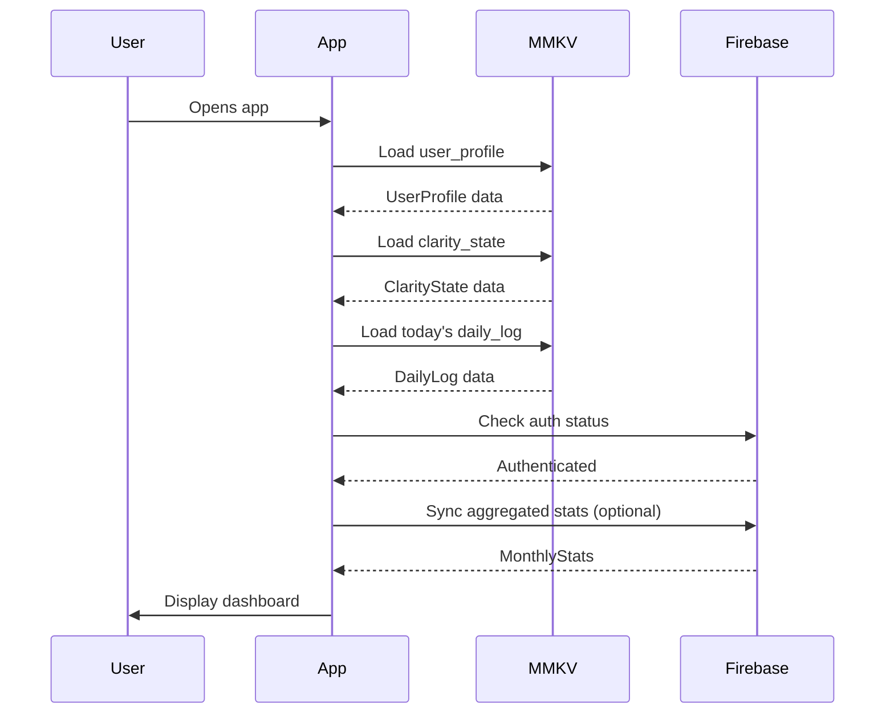
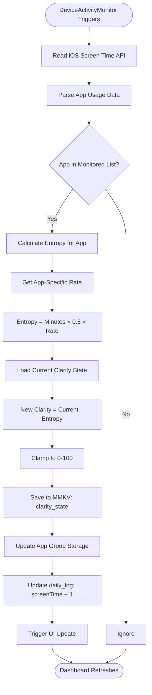
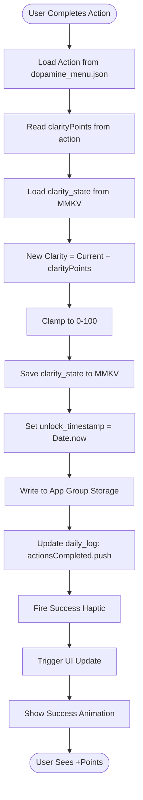

# DATA ARCHITECTURE & ALGORITHMS

**Version:** 1.0  
**Status:** IMPLEMENTATION READY  
**Last Updated:** January 3, 2026  
**Scope:** Schemas, algorithms, data flows

---

## OVERVIEW

Exit uses a **hybrid storage strategy**:
- **Local (MMKV):** Sensitive screen time data, daily logs
- **Cloud (Firebase):** Aggregated stats, user profiles, social features

**Philosophy:** "Local-First" - App works fully offline. Cloud sync is optional.

---

## SECTION 1: DATABASE SCHEMAS

### **1.1 Local Storage (MMKV)**

**Why MMKV?**
- 30x faster than AsyncStorage
- Synchronous API (no await needed)
- Supports encryption
- 10MB size limit (perfect for local data)

#### **Schema: User Profile**
```typescript
// Key: 'user_profile'
interface UserProfile {
  userId: string;
  email: string;
  level: 'npc' | 'glitch' | 'hacker' | 'main_character' | 'oracle';
  streak: number;
  totalActions: number;
  createdAt: number; // Unix timestamp
  lastActive: number; // Unix timestamp
  isPro: boolean;
}
```

#### **Schema: Daily Log**
```typescript
// Key: 'daily_log_YYYY-MM-DD'
interface DailyLog {
  date: string; // YYYY-MM-DD
  clarity: number; // 0-100
  screenTime: number; // Minutes
  appUsage: {
    [bundleId: string]: number; // Minutes per app
  };
  actionsCompleted: {
    actionId: string;
    timestamp: number;
    clarityRestored: number;
  }[];
  interventions: {
    timestamp: number;
    accepted: boolean;
    dismissalCount: number;
  }[];
  consciousDay: boolean;
}
```

#### **Schema: Clarity State**
```typescript
// Key: 'clarity_state'
interface ClarityState {
  current: number; // 0-100
  lastUpdated: number; // Unix timestamp
  todayScreenTime: number; // Minutes
  todayActions: number; // Count
  unlockTimestamp: number; // Unix timestamp
  dismissalCount: number; // Today's dismissals
}
```

#### **Schema: Monitored Apps**
```typescript
// Key: 'monitored_apps'
interface MonitoredApps {
  apps: {
    bundleId: string;
    name: string;
    icon: string; // SF Symbol name
    entropyRate: number; // Multiplier
  }[];
  lastUpdated: number;
}
```

---

### **1.2 Cloud Storage (Firestore)**

#### **Collection: `users/{userId}`**
```typescript
interface UserDocument {
  email: string;
  level: 'npc' | 'glitch' | 'hacker' | 'main_character' | 'oracle';
  streak: number;
  totalActions: number;
  createdAt: Timestamp;
  lastActive: Timestamp;
  
  // Aggregated stats (no raw app data)
  avgClarity: number; // Last 30 days
  avgScreenTime: number; // Last 30 days
  consciousDays: number; // Last 30 days
}
```

#### **SubCollection: `users/{userId}/stats/{date}`**
```typescript
interface StatsDocument {
  date: string; // YYYY-MM-DD
  clarity: number; // End-of-day clarity
  screenTime: number; // Total minutes
  actionsCount: number; // No details, just count
  consciousDay: boolean;
  timestamp: Timestamp;
}
```

#### **Collection: `circles/{circleId}` (Phase 2)**
```typescript
interface CircleDocument {
  name: string;
  owner: string; // userId
  members: string[]; // userIds
  createdAt: Timestamp;
  avgClarity: number; // Group average
}
```

---

## SECTION 2: CORE ALGORITHMS

### **2.1 Clarity Calculation Engine**
```typescript
// src/shared/utils/ClarityEngine.ts
export class ClarityEngine {
  
  // Base formula: Clarity = Current - (ScreenTime × 0.5) + (Actions × 10)
  static calculate(
    current: number,
    screenTimeMinutes: number,
    actionsCompleted: number
  ): number {
    
    // Entropy (negative)
    const entropy = screenTimeMinutes * 0.5;
    
    // Restoration (positive)
    const restoration = actionsCompleted * 10;
    
    // New clarity (bounded 0-100)
    const newClarity = current - entropy + restoration;
    
    return Math.max(0, Math.min(100, Math.round(newClarity)));
  }
  
  // App-specific entropy rates
  private static ENTROPY_RATES: Record<string, number> = {
    'com.zhiliaoapp.musically': 1.5,    // TikTok
    'com.instagram.instagram': 1.0,     // Instagram
    'com.facebook.Facebook': 1.0,       // Facebook
    'com.twitter.twitter': 0.8,         // Twitter/X
    'com.reddit.Reddit': 0.8,           // Reddit
    'com.google.ios.youtube': 0.5,      // YouTube
    'com.netflix.Netflix': 0.3,         // Netflix
  };
  
  // Calculate entropy for specific app
  static calculateAppEntropy(bundleId: string, minutes: number): number {
    const rate = this.ENTROPY_RATES[bundleId] || 0.5; // Default rate
    return minutes * 0.5 * rate;
  }
  
  // Calculate total entropy from app usage map
  static calculateTotalEntropy(appUsage: Record<string, number>): number {
    let totalEntropy = 0;
    
    for (const [bundleId, minutes] of Object.entries(appUsage)) {
      totalEntropy += this.calculateAppEntropy(bundleId, minutes);
    }
    
    return totalEntropy;
  }
}
```

**Example Usage:**
```typescript
// User scrolls Instagram 60 min
const entropy = ClarityEngine.calculateAppEntropy('com.instagram.instagram', 60);
// Result: 60 * 0.5 * 1.0 = 30 points

// User completes 3 actions
const restoration = 3 * 10; // 30 points

// New clarity
const clarity = ClarityEngine.calculate(100, 60, 3);
// Result: 100 - 30 + 30 = 100% (unchanged)
```

---

### **2.2 Conscious Day Evaluator**
```typescript
// src/shared/utils/ConsciousDayEvaluator.ts
export class ConsciousDayEvaluator {
  
  // Evaluate if today qualifies as conscious day
  static evaluate(dailyLog: DailyLog, userLevel: Level): boolean {
    
    // Requirement 1: At least 3 interventions accepted
    const acceptedInterventions = dailyLog.interventions.filter(
      i => i.accepted
    ).length;
    
    if (acceptedInterventions < 3) {
      return false;
    }
    
    // Requirement 2: Screen time below level threshold
    const threshold = this.getScreenTimeThreshold(userLevel);
    if (dailyLog.screenTime > threshold) {
      return false;
    }
    
    // Requirement 3: Final clarity >= 60%
    if (dailyLog.clarity < 60) {
      return false;
    }
    
    // Requirement 4: Dismissals < 3
    const totalDismissals = dailyLog.interventions.filter(
      i => !i.accepted
    ).length;
    
    if (totalDismissals >= 3) {
      return false;
    }
    
    return true;
  }
  
  private static getScreenTimeThreshold(level: Level): number {
    const thresholds: Record<string, number> = {
      'npc': 240,              // 4 hours
      'glitch': 180,           // 3 hours
      'hacker': 120,           // 2 hours
      'main_character': 90,    // 1.5 hours
      'oracle': 60,            // 1 hour
    };
    
    return thresholds[level.id] || 240;
  }
}
```

---

### **2.3 Level Progression Calculator**
```typescript
// src/shared/utils/LevelCalculator.ts
export class LevelCalculator {
  
  private static LEVELS: Level[] = [
    {
      id: 'npc',
      name: 'The NPC',
      thresholds: { avgScreenTime: 240, consciousDaysPerMonth: 0, minClarity: 0 },
    },
    {
      id: 'glitch',
      name: 'The Glitch',
      thresholds: { avgScreenTime: 180, consciousDaysPerMonth: 5, minClarity: 60 },
    },
    {
      id: 'hacker',
      name: 'The Hacker',
      thresholds: { avgScreenTime: 120, consciousDaysPerMonth: 10, minClarity: 70 },
    },
    {
      id: 'main_character',
      name: 'The Main Character',
      thresholds: { avgScreenTime: 90, consciousDaysPerMonth: 15, minClarity: 80 },
    },
    {
      id: 'oracle',
      name: 'The Oracle',
      thresholds: { avgScreenTime: 60, consciousDaysPerMonth: 20, minClarity: 85 },
    },
  ];
  
  // Evaluate monthly stats and return appropriate level
  static evaluateLevel(stats: MonthlyStats): Level {
    // Start from highest level, work down
    for (let i = this.LEVELS.length - 1; i >= 0; i--) {
      const level = this.LEVELS[i];
      
      if (
        stats.avgScreenTime <= level.thresholds.avgScreenTime &&
        stats.consciousDays >= level.thresholds.consciousDaysPerMonth &&
        stats.avgClarity >= level.thresholds.minClarity
      ) {
        return level;
      }
    }
    
    // Default to NPC
    return this.LEVELS[0];
  }
  
  // Calculate monthly stats from daily logs
  static calculateMonthlyStats(dailyLogs: DailyLog[]): MonthlyStats {
    const totalScreenTime = dailyLogs.reduce((sum, log) => sum + log.screenTime, 0);
    const totalClarity = dailyLogs.reduce((sum, log) => sum + log.clarity, 0);
    const consciousDays = dailyLogs.filter(log => log.consciousDay).length;
    
    return {
      avgScreenTime: totalScreenTime / dailyLogs.length,
      avgClarity: totalClarity / dailyLogs.length,
      consciousDays,
    };
  }
}
```

---

### **2.4 Streak Calculator**
```typescript
// src/shared/utils/StreakCalculator.ts
export class StreakCalculator {
  
  // Calculate current streak from daily logs
  static calculateStreak(dailyLogs: DailyLog[]): number {
    // Sort by date (newest first)
    const sorted = dailyLogs.sort((a, b) => 
      new Date(b.date).getTime() - new Date(a.date).getTime()
    );
    
    let streak = 0;
    
    for (const log of sorted) {
      if (log.consciousDay) {
        streak++;
      } else {
        break; // Streak ends on first non-conscious day
      }
    }
    
    return streak;
  }
  
  // Check if streak milestone reached
  static checkMilestone(streak: number): StreakMilestone | null {
    const milestones: Record<number, StreakMilestone> = {
      7: {
        badge: 'first_week',
        title: 'The First Week',
        clarityBonus: -20, // -20% entropy accumulation
      },
      30: {
        badge: 'lunar_cycle',
        title: 'The Lunar Cycle',
        perk: 'deep_actions_unlock',
      },
      90: {
        badge: 'the_season',
        title: 'The Season',
        perk: 'oracle_preview',
      },
    };
    
    return milestones[streak] || null;
  }
}
```

---

## SECTION 3: DATA FLOWS

### **3.1 App Launch → Data Load**


---

### **3.2 Screen Time Update → Clarity Calculation**


---

### **3.3 Action Completion → Restoration**


---

## SECTION 4: JSON INTEGRATION

### **4.1 Dopamine Menu Loader**
```typescript
// src/features/actions/data/actionsLoader.ts
import rawMenu from '../../../data/dopamine_menu.json';
import { MicroAction } from '../../../types/MicroAction';

export class ActionsLoader {
  
  private static cache: MicroAction[] | null = null;
  
  // Load all actions (cached)
  static getAllActions(): MicroAction[] {
    if (!this.cache) {
      this.cache = rawMenu.dopamine_menu as MicroAction[];
      console.log(`Loaded ${this.cache.length} actions from JSON`);
    }
    
    return this.cache;
  }
  
  // Get action by ID
  static getActionById(id: string): MicroAction | null {
    const actions = this.getAllActions();
    return actions.find(a => a.id === id) || null;
  }
  
  // Filter actions by criteria
  static filterActions(criteria: {
    energy?: 'low' | 'medium' | 'high';
    category?: string;
    proOnly?: boolean;
    context?: string;
  }): MicroAction[] {
    let filtered = this.getAllActions();
    
    if (criteria.energy) {
      filtered = filtered.filter(a => a.energy === criteria.energy);
    }
    
    if (criteria.category) {
      filtered = filtered.filter(a => a.category === criteria.category);
    }
    
    if (criteria.proOnly !== undefined) {
      filtered = filtered.filter(a => a.proOnly === criteria.proOnly);
    }
    
    if (criteria.context) {
      filtered = filtered.filter(a => 
        !a.contextMatch || a.contextMatch.includes(criteria.context as any)
      );
    }
    
    return filtered;
  }
  
  // Recommend actions based on context
  static recommendActions(context: {
    clarity: number;
    timeOfDay: string;
    userEnergy: string;
    location: string;
    isPro: boolean;
  }, limit: number = 5): MicroAction[] {
    
    let actions = this.getAllActions();
    
    // Filter by Pro status
    actions = actions.filter(a => !a.proOnly || context.isPro);
    
    // Filter by energy
    actions = actions.filter(a => a.energy === context.userEnergy);
    
    // Filter by location context
    actions = actions.filter(a => 
      !a.contextMatch || a.contextMatch.includes(context.location as any)
    );
    
    // If clarity is critical, prioritize high-impact
    if (context.clarity < 40) {
      actions.sort((a, b) => b.clarityPoints - a.clarityPoints);
    }
    
    // Time-based sorting
    const timeWeights: Record<string, string[]> = {
      morning: ['movement', 'hydration'],
      afternoon: ['movement', 'social'],
      evening: ['breathing', 'sensory'],
      night: ['breathing', 'sensory'],
    };
    
    const preferredCategories = timeWeights[context.timeOfDay] || [];
    actions.sort((a, b) => {
      const aMatch = preferredCategories.includes(a.category) ? -1 : 0;
      const bMatch = preferredCategories.includes(b.category) ? -1 : 0;
      return aMatch - bMatch;
    });
    
    return actions.slice(0, limit);
  }
}
```

---

### **4.2 Daily Quests Loader**
```typescript
// src/features/quests/data/questsLoader.ts
import rawQuests from '../../../data/daily_quests.json';
import { DailyQuest } from '../../../types/DailyQuest';

export class QuestsLoader {
  
  private static cache: DailyQuest[] | null = null;
  
  // Load all quests (cached)
  static getAllQuests(): DailyQuest[] {
    if (!this.cache) {
      this.cache = rawQuests.daily_quests as DailyQuest[];
      console.log(`Loaded ${this.cache.length} quests from JSON`);
    }
    
    return this.cache;
  }
  
  // Get quest by ID
  static getQuestById(id: string): DailyQuest | null {
    const quests = this.getAllQuests();
    return quests.find(q => q.id === id) || null;
  }
  
  // Select daily quest based on context
  static selectDailyQuest(context: {
    userLevel: string;
    location: string;
    timeOfDay: string;
    recentCompletions: string[];
  }): DailyQuest | null {
    
    let quests = this.getAllQuests();
    
    // Filter by unlock level
    quests = quests.filter(q => 
      this.canAccessQuest(q.unlock_level, context.userLevel)
    );
    
    // Filter by location triggers
    if (context.location) {
      quests = quests.filter(q => 
        !q.contextual_triggers?.location || 
        q.contextual_triggers.location.includes(context.location)
      );
    }
    
    // Filter by time triggers
    if (context.timeOfDay) {
      quests = quests.filter(q => 
        !q.contextual_triggers?.time || 
        q.contextual_triggers.time.includes(context.timeOfDay)
      );
    }
    
    // Exclude recently completed (within 7 days)
    quests = quests.filter(q => 
      !context.recentCompletions.includes(q.id)
    );
    
    // Return random quest from eligible pool
    if (quests.length === 0) return null;
    
    const randomIndex = Math.floor(Math.random() * quests.length);
    return quests[randomIndex];
  }
  
  private static canAccessQuest(questLevel: string, userLevel: string): boolean {
    const levelOrder = ['npc', 'glitch', 'hacker', 'main_character', 'oracle'];
    const questIndex = levelOrder.indexOf(questLevel);
    const userIndex = levelOrder.indexOf(userLevel);
    
    return userIndex >= questIndex;
  }
}
```

---

## SECTION 5: PERFORMANCE OPTIMIZATION

### **5.1 Caching Strategy**
```typescript
// src/shared/utils/CacheManager.ts
export class CacheManager {
  
  private static memoryCache = new Map<string, any>();
  private static cacheTimestamps = new Map<string, number>();
  
  // Cache with TTL (time-to-live)
  static set(key: string, value: any, ttlMs: number = 3600000): void {
    this.memoryCache.set(key, value);
    this.cacheTimestamps.set(key, Date.now() + ttlMs);
  }
  
  // Get from cache if not expired
  static get(key: string): any | null {
    const expiresAt = this.cacheTimestamps.get(key);
    
    if (!expiresAt || Date.now() > expiresAt) {
      // Expired, remove from cache
      this.memoryCache.delete(key);
      this.cacheTimestamps.delete(key);
      return null;
    }
    
    return this.memoryCache.get(key) || null;
  }
  
  // Clear all cache
  static clearAll(): void {
    this.memoryCache.clear();
    this.cacheTimestamps.clear();
  }
}

// Usage
const actions = CacheManager.get('all_actions');
if (!actions) {
  const freshActions = ActionsLoader.getAllActions();
  CacheManager.set('all_actions', freshActions, 3600000); // Cache 1 hour
}
```

---

### **5.2 Batch Operations**
```typescript
// src/shared/utils/BatchUpdater.ts
export class BatchUpdater {
  
  private static pendingUpdates: Array<() => Promise<void>> = [];
  private static batchTimer: NodeJS.Timeout | null = null;
  
  // Queue update for batching
  static queueUpdate(updateFn: () => Promise<void>): void {
    this.pendingUpdates.push(updateFn);
    
    // Debounce: execute after 500ms of no new updates
    if (this.batchTimer) {
      clearTimeout(this.batchTimer);
    }
    
    this.batchTimer = setTimeout(() => {
      this.executeBatch();
    }, 500);
  }
  
  // Execute all pending updates
  private static async executeBatch(): Promise<void> {
    const updates = [...this.pendingUpdates];
    this.pendingUpdates = [];
    
    console.log(`Executing ${updates.length} batched updates`);
    
    await Promise.all(updates.map(fn => fn()));
  }
}

// Usage
BatchUpdater.queueUpdate(async () => {
  await StorageManager.set('clarity_state', clarityState);
});

BatchUpdater.queueUpdate(async () => {
  await StorageManager.set('daily_log', dailyLog);
});

// Both execute together after 500ms
```

---

## APPENDIX: TYPE DEFINITIONS
```typescript
// src/types/index.ts

export interface Level {
  id: string;
  name: string;
  thresholds: {
    avgScreenTime: number;
    consciousDaysPerMonth: number;
    minClarity: number;
  };
}

export interface MonthlyStats {
  avgScreenTime: number;
  avgClarity: number;
  consciousDays: number;
}

export interface StreakMilestone {
  badge: string;
  title: string;
  clarityBonus?: number;
  perk?: string;
}

export interface MicroAction {
  id: string;
  title: string;
  description: string;
  category: 'breathing' | 'movement' | 'hydration' | 'sensory' | 'social';
  energy: 'low' | 'medium' | 'high';
  duration: number;
  clarityPoints: number;
  sfSymbol: string;
  proOnly: boolean;
  verification: 'timer' | 'accelerometer' | 'gps' | 'self_report';
  contextMatch?: ('home' | 'work' | 'outside' | 'transit')[];
}

export interface DailyQuest {
  id: string;
  quest_name: string;
  category: 'presence' | 'connection' | 'creation' | 'restoration';
  difficulty: 'easy' | 'moderate' | 'challenging' | 'mastery';
  unlock_level: string;
  duration_min: number;
  verification_method: string;
  rewards: {
    xp: number;
    static_cleared: number;
    conscious_day_credit: boolean;
    badge: string;
  };
  contextual_triggers?: {
    time?: string[];
    location?: string[];
  };
}
```

---

**Document Status:** IMPLEMENTATION READY  
**Dependencies:** MMKV, Firebase Firestore  
**Next Review:** Post-MVP (Week 8)

---
